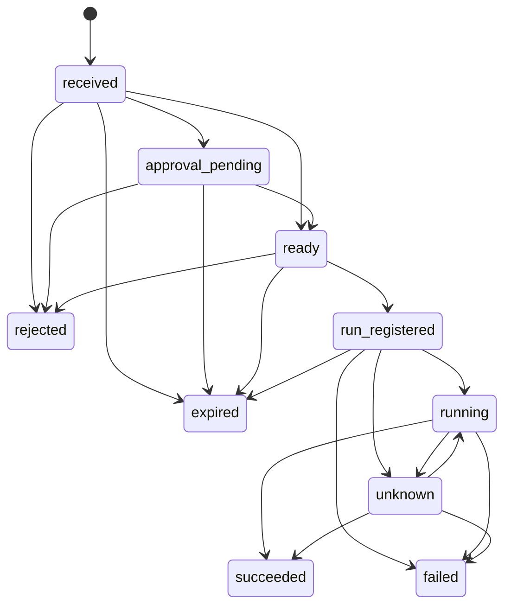

# T01-C：授权、摘要与执行恢复候选

状态：root 设计提案，尚未冻结或实现。配套 [信封候选](t01-envelope-candidate.md)。执行及审批归 Agent24；Hyphae 负责传输、收件和回执投递。本文不是新的任务执行器。

## 时间和不可变内容

query/execution_request 候选生命周期满足 `0 < expires_at - issued_at <= 86400` 秒；issued_at 允许比接收端当前时间最多领先 300 秒，即 `issued_at <= now + 300`。字段关系和安全整数先通过 schema 校验。开跑条件严格要求 `now < expires_at`；过期不因时钟容差、批准已保存或重新投递而延长。共享样例必须包含恰好 86400/86401 秒、未来 300/301 秒和恰好到期的边界。时钟明显不可靠时暂停开跑并报待核对，不能关闭过期检查。

这两个数值是应用候选，尚需双端共享时钟样例；declaration/notification 的生命周期另随子 schema 固定。请求过期限制开跑权限，不把已开始的 run 自动当失败或取消；取消、运行 deadline 和结果验收由相应任务契约定义。已经完成的结果仍可在请求过期后送回，且不会因此重新运行。

同签名作者、目标、request_id 的登记包含类型和不可变执行内容。首次收到后持久化原请求与投递 event_id；同内容重投只附加已验签的合法事件别名、读取既有状态。同 ID 改类型、参数、权限、有效期、预算或隐私要求均返回 REQUEST_CONFLICT。请求只有明确授权范围收口后才可开跑。

## 摘要候选

采用 [RFC 8785 JCS](https://www.rfc-editor.org/info/rfc8785/) 对显式执行投影做规范化，再计算 SHA-256。先通过 JSON 输入与业务 schema 检查；不对原始 JSON 文本或默认 Go serializer 的输出直接做授权 hash。JCS key 排序按 UTF-16 code unit，数组保留顺序，字符串不做 Unicode normalization。Go 与 Agent24 要验证固定的 canonical bytes，而非只比较各自生成的 hash。

投影须覆盖 protocol、execution_request 类型、签名来源作者、目标、request_id、issued_at/expires_at、能力 ID/精确版本、params、权限范围、模块版本、隐私/实际推理落点要求，以及预算上限和单位。精确字段名、必填/可空/默认值等待 T01-B/D 完成；缺字段不能由执行器补出更宽权限。未知执行字段拒绝，避免新增参数没有进入摘要。

候选 hash 输入为 ASCII `hyphae-execution/1`、一个 NUL 字节、再接投影的 JCS UTF-8 字节；输出 64 字符小写 hex。协议升级更换域分隔符。投影不含可变化的 relay 地址、密文、Nostr event_id、显示名、投递状态、回执和实际用量；这些字段不改变执行许可。审批绑定该摘要、目标、能力版本、范围和期限，开跑前重新核对。

必须有共享固定样例：key 顺序/空白/合法 Unicode 转义变化得到相同摘要；数组顺序、参数、版本、目标、期限、权限、隐私或预算变化得到不同摘要；null/缺省按 schema 明确处理；非 BMP key 与控制字符序列化有固定预期。没有完成字段表和双语言验证前，不能声称摘要格式已经可用。

## 状态、事务和崩溃边界

| 状态候选 | 必须已持久化/确认的事实 | 可否直接启动新 run |
|---|---|---|
| received | 请求键、原请求、摘要候选与合法事件关联已登记 | 否 |
| approval_pending | 持久化待审批项 | 否 |
| ready | 明确批准，范围与摘要相符 | 再检查前置后才能登记 run |
| run_registered | 原子登记唯一 run_id 与请求关系 | 只能使用这个 run_id 核对或幂等启动 |
| running | 执行器确认该 run 已开始 | 否 |
| succeeded/failed | 执行器明确终态，结果或错误已保存 | 否 |
| rejected/expired | 未启动时拒绝或过期，原因已保存 | 否 |
| unknown | 执行器调用与落盘之间的事实无法确定 | 否；先按 run_id 核对 |

候选允许的转换如下；每条边还须满足表内事实和授权前置，不按收到的状态字符串直接跳转。

received 直接到 ready 也必须有明确、持久化且符合本请求范围的已有授权。run_registered 到 expired 仅允许在确认启动调用尚未发起、执行器没有开始时使用；存在不确定调用就转 unknown。failed 需执行器明确失败事实，不能把超时猜作失败。终态没有出边；unknown 无法核对时保持原状态。

状态不是 relay ACK 的别名。ready 仍需在登记和实际启动前检查期限、预算、所选 provider 和路由限制、模块版本和权限；实际推理落点与用量由模型适配器核对，不能用回环服务地址推断。run_registered 与跨服务启动之间若不能使用原子事务，执行器必须接受持久化幂等键并支持 run 查询；缺这项能力时只能停在待核对，不能按“没有结果”重新开跑。

接收重复、并发重放和重启均使用同一个请求登记。query、通知、注册、旧 F4 和回执的 run 数为零。审批等待可恢复；拒绝或审批超时不启动 run。run 开始后的崩溃由执行器事实决定恢复，不以本地收到几条消息推断执行次数。

执行器是实际 run 和副作用的事实来源。Agent24 从它获取并核对终态/结果后，在自身可靠存储内原子提交这个终态观察、结果与待发回执；这不是跨服务事务，不能声称同时提交执行器的内部状态。Agent24 本地事务失败时不发送完成回执，按同一 run_id 再查询并核对后恢复本地提交，不重做副作用。回执投递失败保留已存结果，恢复时只补发回执。Hyphae outbox 保存的是传输记录，不替代 Agent24 的执行结果账本。

## 回执与状态修订

execution_receipt 是该修订的完整状态快照，候选包含从 1 开始、按请求单调递增的 receipt_seq，以及状态、请求摘要、适用的 run_id、结果或结构化错误。具体必填关系、用量和结果字段由 B/D 子 schema 固定；sender 不能用自由 status 字符串更新状态。

只接收来自原目标、投给原作者且 e/request_event/request_id 匹配已登记请求的回执。每个 revision 的语义内容须保持不变；同 seq 不同状态/结果是冲突，记录异常并核对，不按到达时间覆盖。重发同一 revision 可以重新签名投递，但不能悄悄改变结果。

上图约束执行端的实际持久化转换；请求方维护的是对端报告的状态镜像。镜像允许跳过丢失的中间回执：更高 seq 的完整快照，若身份/关联/摘要匹配、字段齐全且从旧状态沿图存在合法路径，可采用其新状态。例如 approval_pending 后收到较高 seq 的 succeeded，不要求先补齐 ready/running。首次快照按 received 可达性检查；运行和执行终态必须带匹配请求的 run_id，已绑定后不能换成另一个 run。不能跨越或改写镜像已有终态，也不能把快照当远端副作用的独立证明。

低于已处理 seq 的回执只作诊断，不回退状态；同 seq 同语义幂等。不完整快照、不可达状态、不同 run_id 或同 seq 冲突保留原镜像并标记待核对。执行端的 unknown 可以在执行器确认同一 run 已开始后恢复 running，或在明确结果后转入合法终态；未找到 run 不足以证明副作用未发生，不能生成新 run 重试。不能用 issued_at 大小代替 revision 和状态转换检查。

Agent24 发送端与接收端须共同固定回执语义投影，避免重投时间或 event_id 变化被误认成结果冲突；这项仍待 schema 样例，本文不自行补实现。普通文本、旧 answer/ack/report 和查询 response 不参加执行状态修订，也不自动生成新的执行请求。

## 验收边界

共享状态样例至少覆盖未授权、预算拒绝、本地模型不可用、越权模块、同 ID 参数冲突、并发重放、审批重启、run 调用前后崩溃、结果事务失败、断线补回执、未知/第三方关联、重复及乱序 revision、终态冲突。

真实验收需要可观察的受控副作用计数和执行器 run 查询。只读 Sin90 today 查询、静态 JSON、Hyphae 历史行数和 relay ACK 均不能代替这一证据。跨仓实现由用户推动，回填 Agent24/iDoris/AgentEar/模块版本与命令；T01-E/T19 未通过前仍不记完整 E-M1 通过。
